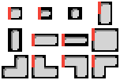
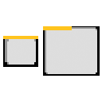
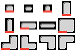
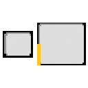
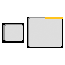
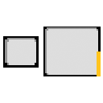
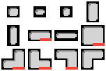

---
tags:
  - Enum
---
# Enum "DoorSlot"
|DLC|Value|Enumerator|Info|
|:--|:--|:--|:--|
|{: .alldlc .tooltip .badge }|-1 |NO_DOOR_SLOT {: .copyable } |  |
|{: .alldlc .tooltip .badge }|0 |LEFT0 {: .copyable } |  |
|{: .alldlc .tooltip .badge }|1 |UP0 {: .copyable } |  |
|{: .alldlc .tooltip .badge }|2 |RIGHT0 {: .copyable } |  |
|{: .alldlc .tooltip .badge }|3 |DOWN0 {: .copyable } |  |
|{: .alldlc .tooltip .badge }|4 |LEFT1 {: .copyable } |  |
|{: .alldlc .tooltip .badge }|5 |UP1 {: .copyable } |  |
|{: .alldlc .tooltip .badge }|6 |RIGHT1 {: .copyable } |  |
|{: .alldlc .tooltip .badge }|7 |DOWN1 {: .copyable } |  |
|{: .alldlc .tooltip .badge }|8 |NUM_DOOR_SLOTS {: .copyable } |  |